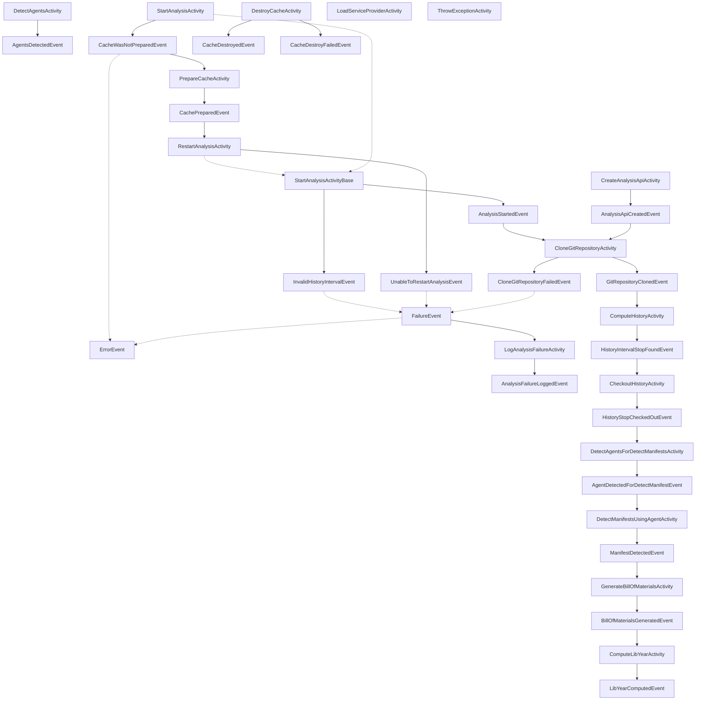

# Activities and Events

Much of the application's architecture is implemented through a series of classes that descend from the `IApplicationActivity` and `IApplicationEvent` interfaces. An activity is responsible for performing work in the processing pipeline. The pipline is set up so that more than one activity can be run at a time, controled by the number of worker processes that are handling the activities. Once an activity is done with its work, it generates an event. Events are responsible for knowing what activity should be dispatched next.

This approach allows us to have chunks of the application's processing pipeline isolated into neat chunks. Each one is easy to test and easy to reason about. Complications arise when we attempt to try to figure out how all the different activities and events are interacting with each other. The diagram below attempts to address this problem.

Here are some things to keep in mind when viewing the graph:

* Each box is a class that implements either the `IApplicationActivity` or `IApplicationEvent` interface.
* Each arrow with a solid line represents a "creates" relationship. The source class creates an instance of the destination class.
* Each arrow with a dotted line represents an "is a" relationship. The source class inherits from the destination class.

